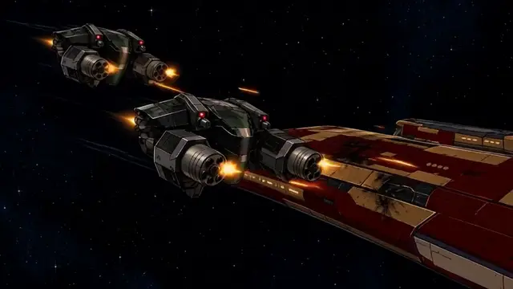
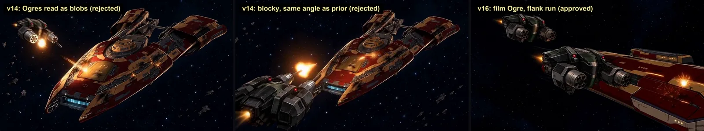
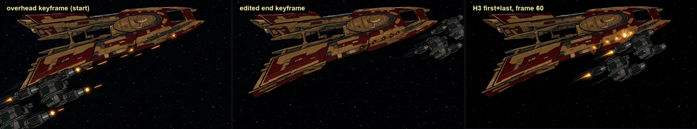
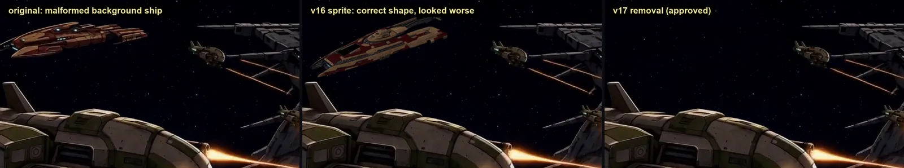
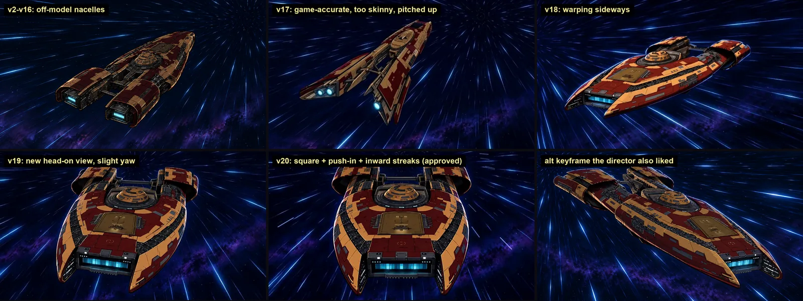
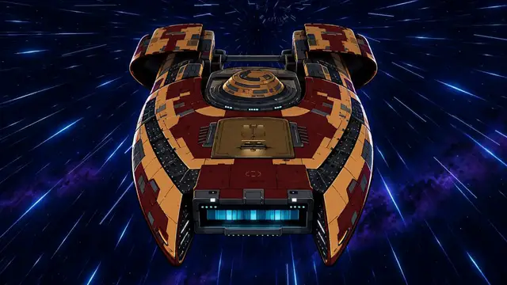
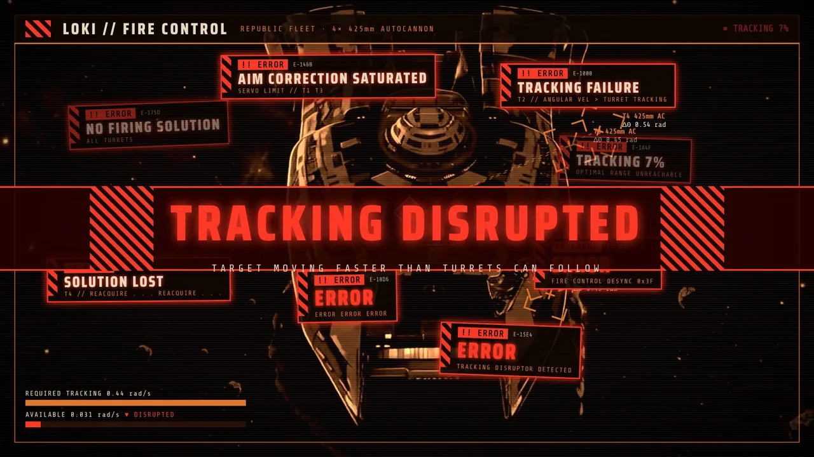

# Can You See Me Now (EVE Online AMV, 2026)

*A 3:13 anime-style music video. A Pilgrim recon cruiser cloaks, ambushes a Loki, duels a Myrmidon and its drones, and hunts a Raven. It went through twenty full drafts over several weeks, and I approved the final cut on September 30, 2026.*

🎬 **Watch:** *(YouTube link to be added at release)*

## At a glance

| | |
|---|---|
| **Length** | 71 shots, 4,622 frames at 24 fps, delivered at 1080p and 1440p |
| **Motion** | MiniMax H3 image/reference-to-video in ComfyUI. Hundreds of takes, run locally on an RTX 5090 and two GB10 boxes. |
| **Keyframes** | GPT Images edits, plus code-rendered previs from real ship geometry for staging |
| **Overlays** | Remotion HUDs, title and end cards |
| **Finishing** | Code motion layers (push-ins, beat-locked warp streaks), compositing repairs, and a Python assembler that verifies every master |
| **People and agents** | Me (DienerTech) as director and reviewer. Claude and Codex as production agents: each solo, and together in one peer-review run. |

## How a shot got made

1. **Stage it.** Stage in code with the real geometry, or start from an approved frame.
2. **Draw the keyframe(s)** with GPT Images. Each input image gets one stated job. See [GPT Images notes](../../models/gpt-image/).
3. **Screen, then review.** Silhouette metrics screen the candidates. Then the [asset-accuracy review](../../workflows/asset-accuracy-review.md) runs, and for hero assets there's a crop check with me.
4. **Animate with H3.** Use first, last or interior guides, with at least two seeds, and review the whole take frame by frame. See [H3 notes](../../models/minimax-h3/).
5. **Select a range.** Pin a measured event (a first flash, the guns stopping) to a musical accent by choosing the in-point.
6. **Finish in code.** Add overlays and motion layers, and repair in post where needed.
7. **Assemble and verify.** Every master is checked: exact source ranges, bit-exact audio, per-shot placement, a scan for repeated frames, and colour range.

## Three stories from the cut

### 1. The Ogre attack: from tableau to flyby

For several drafts the enemy drones hovering and shooting at the Pilgrim "looked bad", as I put it in review. They were small blobs, or the boxy real-game model, and the camera repeated the previous shot's angle. The fix had three parts:
- **The film's own drone design as the identity reference**, with the layout's drones treated as placeholders.
- **A run instead of a pose.** The drones strafe the hull's length with the camera leading them.
- **A new angle for each shot:** a starboard lead-tracking shot, then a steep overhead.

My review note on the result: *"Love the ogre shots tho, those flyby attacks are really nice."*

### 2. The background ship that got worse when we fixed it

A chase shot I loved had a malformed Pilgrim in the background. Claude's tracked replacement had exactly the right geometry and looked *worse* to me: a mosaic cutout. The fix I approved was to **remove** the ship and keep every foreground pixel bit-exact. See [Compositing repairs](../../techniques/compositing-repairs.md).

### 3. The warp shot: seven tries

The warp shot is reused at three points in the film, so errors in it compound. The quotes are my review notes:

| Draft | What happened |
|---|---|
| v2–v16 | An off-model ship with boxy nacelles |
| v17 | Game-accurate geometry: **"distinctly skinnier"** than the film's house design, and pitched up |
| v18 | Reused the neighbouring shot's frame: **"warping sideways"**, and copying an existing shot "looks weird and lazy" |
| Rear-view redraws | **"Do not look like the pilgrim"**. The house design has no approved stern view. |
| v19 | A new head-on view I picked from a crop sheet Claude showed me. Its slight yaw was fixed in v20. |
| v20 | Squared up, plus a code push-in and beat-locked streaks. Claude's first streak version flowed *outward* and to me "looked backwards"; the fix sends them into the vanishing point. **Approved.** |

Lessons we took from it:
- The identity authority is the production's house design.
- Effects must follow the subject's heading.
- New shots need new cameras.
- A human crop check up front saves rounds.

## Sample prompts

A selective sample, with outcomes. Failures included.

| Prompt | What it shows |
|---|---|
| [GPT: flank-run keyframe](prompts/gpt-01-ogre-flank-keyframe.md) | Layout for shape, house art for paint, film drone for design |
| [GPT: end keyframe as an edit](prompts/gpt-02-overhead-end-edit.md) | Matched first and last guides |
| [GPT: new head-on view](prompts/gpt-03-headon-warp-keyframe.md) | A new camera on an established face |
| [GPT: square-up edit](prompts/gpt-04-square-headon-edit.md) | A one-respect edit of an approved frame |
| [GPT: rear view (failed)](prompts/gpt-05-FAILED-rear-view.md) | Inventing an unseen view |
| [H3: flank run](prompts/h3-01-ogre-flank-run.md) | First guide only |
| [H3: overhead flyby](prompts/h3-02-overhead-flyby.md) | First + last guides |
| [H3: anchored warp](prompts/h3-03-headon-warp-anchored.md) | First + interior + last guides |

## Overlays

The approved Loki fire-control HUD is included as a runnable Remotion example: [remotion/](remotion/).

## What we'd do differently

- **Have the agents show me crop checks from the start.** It was the single most efficient step.
- **Write the landmark checklist for each recurring asset on day one.** Name its identity authority (the house design) at the same time.
- **Don't trust a clean endpoint.** Floods happen mid-take.
- **Stage drone action as runs from the first storyboard.**
- **Measure the song's meter before cutting.** Our first edit grid was built on the wrong beat length.

---

*EVE Online® is a trademark of Fenris Creations hf. (formerly CCP Games). This fan work is used with limited permission of Fenris Creations; no official affiliation or endorsement is stated or implied. Music: "Clowns (Can You See Me Now?)" by t.A.T.u. It appears only in the video. See [NOTICE.md](../../NOTICE.md).*
