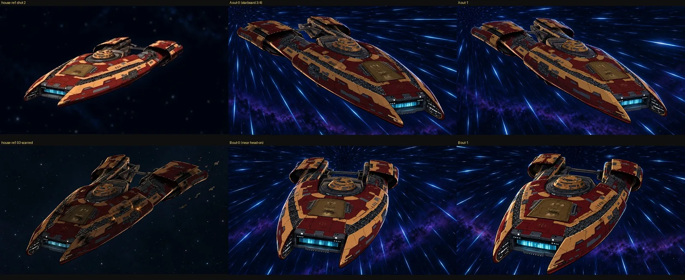

# GPT Images: new head-on view of the house design (my pick)

**Model:** `gpt-image-2.5-sunburst` · **Size:** 1536x1024 · **Candidates:** 2

| Input | Role |
|---|---|
| Image 1 | house-design Pilgrim (approved) |
| Image 2 | house-design Pilgrim (shot 2) |
| Image 3 | warp streak painting style |

## Prompt

```text
Draw a NEW finished frame of a late-1990s hand-painted cel-animated space opera.

The ship is the Pilgrim cruiser exactly as this film draws it in Images 1 and 2 - same design, proportions and paint: a broad flat armoured hull with two long forward prongs framing a glowing blue bow recess, a gold rectangular hatch plate on the forward dorsal hull, a round tiered dorsal dome behind it, and two long raised aft armour blocks with curved leading edges carried on struts above the rear of the hull, joined by a thin truss; large burgundy and warm-gold panel blocks with dark mechanical inset strips; bold dark ink outlines and hard two-tone cel shading. No battle damage, no scorch marks.

New camera: nearly head-on from slightly above and a little to the left of the bow. The two forward prongs and the glowing blue bow recess point almost straight at the viewer; the gold hatch plate and the round dorsal dome rise behind them; the two raised aft armour blocks on their struts are visible on either side further back. The ship is large, level and centred, filling about half the frame width.

The ship rushes toward the viewer out of a warp tunnel: fine bright blue star streaks radiate from ONE vanishing point directly behind the ship, slightly above centre, and fan outward past it toward the viewer and the frame edges, like the streaks in Image 3. Deep indigo space, a faint purple nebula band, a subtle cool blue rim light on the hull edges. No other craft, no planet, no text, no UI. The picture stays inside the central 16:9 band; top and bottom margins continue the background.
```

## Outcome

I picked out-0 from a crop sheet. I also judged the companion prompt's starboard three-quarter view to be on-model.


