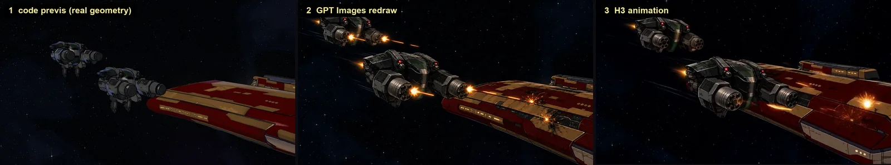

# Code directs, AI draws: previs with real geometry, then redraw

**Problem.** When a keyframe is drawn by an image model from scratch, the model can invent the subject's shape. H3 then animates the invented shape faithfully. We lost several drafts to a hero ship that looked plausible but was wrong.

**Approach.** Split the jobs:

| Layer | Tool | Output |
|---|---|---|
| 1. Direction | Code: a small WebGL scene with the real ship geometry, frame-stepped in headless Chrome | Staging, camera, placement, headings, fire lines. A **silhouette mask** per object. |
| 2a. Drawing | GPT Images edit | The layout redrawn in the film's style. Approved art controls paint; the layout controls shape only. |
| 2b. QA | Silhouette score + a human look | IoU against the true mask, raw and after best scale/shift alignment. Plus the [asset-accuracy review](../workflows/asset-accuracy-review.md). |
| 3. Motion | H3 with the keyframe(s) as guides | Animation with the drawing locked in. |

## What worked

- **Aligned shape scores separate reframing from drift.** A redraw that enlarges the ship scores low raw but high after alignment. That's a framing change, not a shape error. **Tested.**
- **Staging and camera problems are cheap to solve in code.** We iterated about five cameras for one shot in minutes, before spending any image or video budget:
  - checking which side of the ship the drones fly on;
  - checking that the subject's angle differs from the neighbouring shots;
  - getting the drones large enough to read.
- **Placeholders for secondary subjects.** Render the drones at the right position, heading and size, and let the image model redraw them from the film's approved drone frames. **Tested.**

## Where it misled us

- **Real geometry is not the same as the house design.** A long-running production develops its own look. Our hero ship's approved design is chunkier than the game model. I rejected a redraw that matched the game hull exactly as "a distinctly skinnier ship". The production's approved art is the identity authority; real geometry only helps with structure. See the [warp story](../projects/can-you-see-me-now/#3-the-warp-shot-seven-tries).
- **A shader over dense game textures isn't a drawing.** To me, Claude's code-only cel looks felt like "cel-shaded EVE", not the hand-drawn feel I wanted. Keep code for direction and effects, and let the image model do the drawing.

## Minimal recipe

1. Stage the shot in code. Render a 1536×1024 layout plus per-object masks at the chosen camera.
2. Redraw with 3–4 references, each with a stated role: layout (shape), approved art (paint), approved subject frames (design), style crop (background).
3. Score the candidates against the mask, then review them side by side with the approved art at the same angle.
4. If the action needs an end state, make the end keyframe by **editing** the chosen start keyframe, with a second layout for the new positions.
5. Animate with first + last guides (or first + interior + last for long takes), with at least two seeds.
